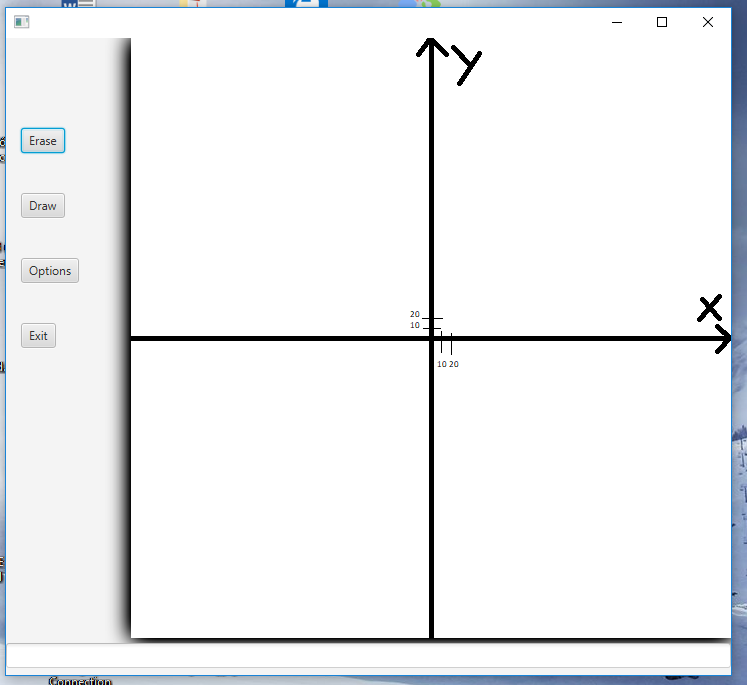

# functions-graph
Very very simple project with GUI, that allows user to draw simple graphs of polynomials
## Informations
* [General Info](#general-info)
* [Techonologies](#technologies)
* [How to open](#how-to-open)
* [How to use](#hot-to-use)
* [Author](#author)
* [Screenshot](#screenshot)

## General Info
This project can draw a graph of any polynomial function. It's very simple project, so the scale is so big and it's unzoomable.

## Technologies
Project was made in java 8, the GUI was created in javaFX

## How to open'
This project has GUI, so just open by double click on JAR file

## How to use
To draw some graph you need to remember how to do it. First, you need to enter "+" or "-" before every monomial, even if this monomial is first in polynomial. Second, if you would like to multiply "x" with some factor, you need to enter "*" before the "x". Third, if you would like to enter an exponent of some power, you need to do it in braces and after "^". F.e. if you want to enter the monomial 2x, you should do it like this: +2*x. If you want to enter "x square" you should do it like this: +x^(2). If you want to enter 2x^2 + 3x - 1 you should do it like this: +2*x^(2) + 3*x - 1

## Author
Whole project was made by me, it took me a few days.

## Screenshot

